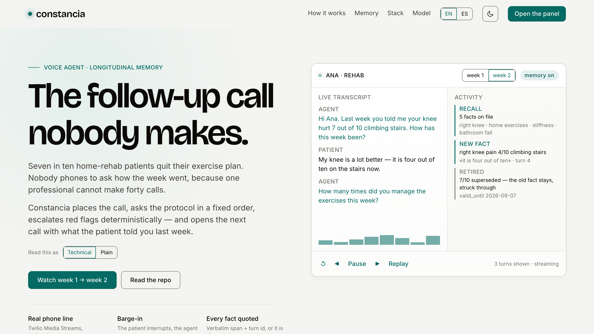
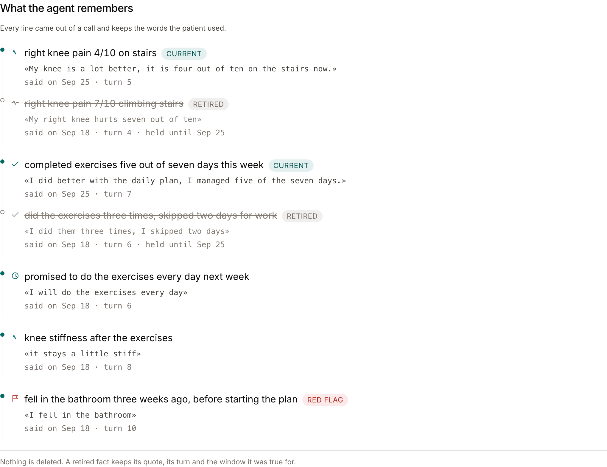
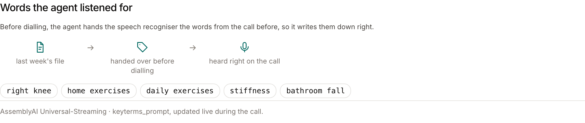

<p align="center">
  
</p>

<p align="center">
  <b>Seven in ten home-rehab patients quit their exercise plan.</b><br>
  constancia phones them every week, asks the protocol in a fixed order, escalates a red flag in code rather than in a prompt —<br>
  and opens the next call with what they said in the last one. No quote, no fact; a contradiction retires the old one instead of deleting it.
</p>

<p align="center">
  <a href="https://youtu.be/iVDlC5y0Z38"><b>Demo video</b></a> ·
  <a href="https://constancia-voice.onrender.com"><b>Live demo</b></a> ·
  <a href="https://constancia-voice.onrender.com/panel"><b>The panel</b></a> ·
  <a href="https://gmassello.github.io/constancia/deck.html"><b>Deck</b></a> ·
  <a href="docs/SUBMISSION.md"><b>Submission</b></a> ·
  <a href="docs/README.md"><b>Docs</b></a>
</p>

<p align="center">
  <a href="LICENSE"></a>
  <a href="pyproject.toml"></a>
  
  
  
</p>

---

Built for the [lablab.ai x AssemblyAI Voice Agent Hackathon](docs/HACKATHON.md) on **Path B** — a real
phone call, not a browser mic. The whole thing runs with no keys and no network:

```bash
uv sync
make demo MEMORY=on   # week 2 over the seed: recall, key terms, a retired fact
```

<p align="center">
  
  <br>
  <sub>The agent calling a patient. Recorded off the phone, not a mockup.</sub>
</p>

<table>
<tr>
<td width="33%"><b>Call</b><br>Twilio Media Streams carries the line; AssemblyAI Universal-Streaming v3 hears it in real time over &micro;-law at 8&nbsp;kHz, end-of-turn driven. The patient interrupts and the agent stops.</td>
<td width="33%"><b>Remember</b><br>Every fact carries a literal span of something the patient said, with its turn id. A contradiction retires the old fact and keeps its quote; nothing is deleted. Next week opens with it.</td>
<td width="33%"><b>Escalate</b><br>The red-flag guard is deterministic code with a negation window. The model phrases the escalation; it never decides there is one.</td>
</tr>
</table>

**Two AssemblyAI products, three capabilities.** Universal-Streaming v3 carries the live call;
Speech Understanding reads the recording afterwards for entities, sentiment and key phrases, and the
panel shows all three. Feeding those phrases back as the next call's `keyterms_prompt` was built,
**measured on a real recording, and taken back out** — see *Honest limits*.

### Three minutes

|  |  |
| --- | --- |
| **See the memory pay off** | <https://constancia-voice.onrender.com/panel> — press **Call with memory**, then **Call without memory**. Same questions either way; only one of them opens by quoting last week. No keys, nothing to install |
| **See that it is not asserted** | The same panel, *What the agent remembers*: every line carries the patient's own words and the turn they were said in, and the retired ones are still there, struck through |
| **See the code that decides** | [`app/guard.py`](app/guard.py) for the escalation, [`app/extract.py`](app/extract.py) for the no-quote-no-fact rule, [`app/stt.py`](app/stt.py) and [`app/analysis.py`](app/analysis.py) for the two AssemblyAI products |
| **See what does not work** | [`#honest-limits`](#honest-limits) and [`docs/PENDINGS.md`](docs/PENDINGS.md). No authentication, one worker, extraction after hangup |

---

## What it remembers, and how you check it

Not a mock-up: the panel after a week-2 call, run from the scripted buttons with no keys.

<p align="center">
  
</p>

<p align="center">
  
</p>

**Live**: <https://constancia-voice.onrender.com> — the landing at `/`, the professional's panel at
`/panel`, one service. It runs on a free instance that sleeps after fifteen idle minutes, so the
first request after it has slept spends the cold start waiting for the container.

## The 30-second version

Patients in home rehab abandon their exercise plan about 70% of the time. Nobody calls to ask how it went, because the professional cannot scale it. **constancia** places the call: it asks the protocol questions in a fixed order, escalates deterministically when a red flag shows up, and — from stage 2 on — opens the next call by asking about what the patient reported the week before, with superseded facts retired instead of deleted.

The same engine serves three verticals as config packs: `rehab`, `postpartum`, `chronic`.

Built for the [lablab.ai × AssemblyAI Voice Agent Hackathon](docs/HACKATHON.md) on **Path B**: AssemblyAI Universal-Streaming v3 over a real phone call, Gemini Flash for phrasing, ElevenLabs for µ-law audio, Twilio Media Streams for the line. Off the call, Jev answers one typed question about one sentence — see [`docs/ARCHITECTURE.md`](docs/ARCHITECTURE.md) § *System boundaries* for what crosses and what does not.

## Where the build is

Stage 3 of four plus the public landing (see [`docs/PLAN.md`](docs/PLAN.md) and [`docs/LANDING.md`](docs/LANDING.md)): **the voice loop, longitudinal memory, the professional's panel and the page that explains them**. What works today:

- Outbound Twilio call with a bidirectional `<Connect><Stream>`.
- Live µ-law audio to AssemblyAI Universal-Streaming v3 in English, end-of-turn driven.
- Gemini Flash phrases each turn; the orchestrator decides which question comes next and will not let one be skipped.
- Barge-in: the patient interrupts, the agent stops and the queued audio is cleared.
- Deterministic red-flag guard with negation handling. The LLM only phrases the escalation.
- Promises recognised by deterministic rules, and a typed second opinion from Jev only where the
  rules' vocabulary runs out. The rules still set the score, and with no key the second opinion is
  simply off (`make smoke-jev`).
- Per-call trace as an append-only event stream at `GET /calls/{id}/trace`.
- **Memory**: the call opens with every current fact for that patient in the system prompt, and their key
  terms in the STT `keyterms_prompt`. After hangup the transcript is extracted into facts, each grounded in a
  verbatim patient quote and its turn id; a fact that contradicts an old one retires it (`superseded_by` +
  `valid_until`) instead of deleting it. `memory=false` on a call disables recall and store, nothing else.
- `GET /patients/{id}/chain` returns the whole chain, current facts with the ones they retired
  hanging off them; `/facts` returns the same rows flat. Every route is in [`docs/API.md`](docs/API.md).
- **A public landing** at `/`, built on the Cadence design system, with three reader preferences: light or
  dark theme, English or Spanish, and a technical or plain register — the same page written for a judge and
  for the physiotherapist who would pay for it. It opens light and in English; `?lang=es` opens it in Spanish
  directly, and every choice is remembered.
- **The professional's panel** at `/panel`: patient list, how the two tracked measures are moving — pain out of ten and sessions a week, each with its scale and whether the change is good — the supersession chain with the
  verbatim quote and turn id behind every fact, the key terms that fed the STT, and the live call —
  transcript and activity rail over SSE, with the new facts highlighted as they land. It reads the same
  theme and language the visitor chose on the landing.
- **Three call modes.** `live` dials a real phone. `scripted` runs the whole pipeline against a scripted
  patient, with no phone and no keys. `replay` replays a recorded call at its original pace. The last two are
  what make the demo survive an outage.
- **After hangup** the recording goes to AssemblyAI's pre-recorded API for entity detection, sentiment and
  key phrases, stored in `calls.analysis` and shown in the panel. Feeding the phrases back into the next
  call's `keyterms_prompt` was built and then reverted on a measurement — the reason is in *Honest limits*.

The video and the deck are linked at the top. [`docs/SUBMISSION.md`](docs/SUBMISSION.md) says what backs each judging criterion and where a judge sees it; [`docs/PENDINGS.md`](docs/PENDINGS.md) says what is still open.

> [!WARNING]
> There is no authentication anywhere. Anything that can reach the URL can read every patient's history and
> place a call. This is a hackathon demo with fictitious data, not a product.

## Documentation

[**`docs/README.md`**](docs/README.md) is the index: it says which document answers which question.

| | |
|---|---|
| [`docs/PRODUCT.md`](docs/PRODUCT.md) | what this is and who pays for it, without jargon |
| [`docs/ARCHITECTURE.md`](docs/ARCHITECTURE.md) | one call end to end, the phases, the three modes, memory |
| [`docs/BACKEND.md`](docs/BACKEND.md) | the twenty-two modules and the four worth reading first |
| [`docs/FRONTEND.md`](docs/FRONTEND.md) | build, design system, the bilingual machinery, the panel |
| [`docs/API.md`](docs/API.md) | all twenty-four routes, the webhooks, the SSE contract |
| [`docs/OPERATIONS.md`](docs/OPERATIONS.md) | running it, every environment variable, Docker and Render |
| [`docs/WORKING.md`](docs/WORKING.md) | the Makefile, the gates, the conventions |
| [`docs/DESIGN.md`](docs/DESIGN.md) | **Cadence**, the design system — as a target; each section says what is built |
| [`docs/PENDINGS.md`](docs/PENDINGS.md) | everything still open, and the command that closes each one |

[`docs/INTENT.md`](docs/INTENT.md), [`docs/PLAN.md`](docs/PLAN.md) and
[`docs/LANDING.md`](docs/LANDING.md) are records rather than reference — the spec written before the
code, the build order with its deviation register, and the landing's design log.

## Run it

No keys needed for the offline path:

```bash
uv sync
make test          # 319 tests, no network and no database
uv run pytest tests/test_guard.py::test_red_flags_fire   # one test, the 90% case
uv run pytest -k supersede                               # or by name, across files
make lint          # ruff
make web           # builds web/dist (needs node 24 and pnpm); tsc -b is the front-end check
make dev           # http://localhost:8001 — the landing; the panel is at /panel
make take          # the same server without --reload, for a recording session
```

The panel offers the A/B as two buttons: **Call with memory** and **Call without memory**. Both run the whole
call with no phone and no keys — the transcript appears turn by turn, the rail lights up as facts land — and
the difference is the point: with memory the agent opens by quoting last week and the 7/10 knee ends struck
through by the 4/10; without it, the call starts from scratch. Both sides of that transcript are canned: with
no `GEMINI_API_KEY` the agent's lines come from `seed/scripts.json`, keyed to the pack's question ids, not
from the model. *Replay a recorded call* plays a fixture instead, **Call with a red flag** runs the `alarm` script — the
patient reports a fall, the guard stops asking and the call is marked — and the two **Real phone** buttons
appear only when the instance carries a `DEMO_PHONE` of its own, which credentials alone do not give it.
None of the scripted buttons ever places a real call.

`POST /reset` puts the in-memory seed back where it started, which is what a second take needs.

Without the front end built, the same thing from the terminal:

```bash
make demo            # week 1: a full call against a scripted patient, trace printed
make demo MEMORY=on  # week 2 over the seed: recall, keyterms and a superseded fact
make fixtures        # re-records seed/replay/*.json from the scripted mode
```

With a Gemini key the same demo uses real phrasing:

```bash
GEMINI_API_KEY=... make demo
```

Memory needs Postgres with pgvector. `DATABASE_URL` is optional: without it the service runs on the
JSON seed and only the memory phases are skipped. It is read through `settings_or_none()`, so it does
nothing on its own — the eight required variables have to validate first, or the store stays the
seed whatever the connection string says.

```bash
make db            # pgvector/pgvector:pg17 on localhost:5432
make schema        # applies schema.sql, idempotent
make seed          # Ana, one week-1 call and its facts
uv run pytest -m integration
```

For a real phone call, copy `.env.example` to `.env`, fill it, expose the port and dial:

```bash
ngrok http 8001                       # PUBLIC_BASE_URL is the https URL it prints
make dev
make smoke PHONE=+54911...            # geographic permissions, no LLM or TTS credit spent
make smoke-stt && make smoke-tts      # the two failure modes that cost the most time
make smoke-call                       # the six phases against the real LLM, no phone
make call                             # dials DEMO_PHONE; make call PHONE=+54911... overrides it
make smoke-analysis URL=<recording url>   # entities, sentiment and key phrases on a real recording
make smoke-keyphrases URL=<recording url> # the same recording with and without auto_highlights
```

## Honest limits

- **No authentication anywhere.** Anything that can reach the URL can read every patient's history and place a call. Out of scope for the hackathon, and the landing's footer says so. The panel hides its two *Real phone* buttons unless the instance carries a `DEMO_PHONE` of its own, which is what keeps a deployed demo from dialling — but that is a UI gate, not a lock: `POST /calls` with `mode=live` and an explicit `phone` still dials wherever the credentials reach.
- **Key phrases are shown, not fed back.** `auto_highlights` runs on the recording and the panel shows
  what it found, but those phrases do **not** prime the next call. That half was built and measured against
  a real recording on 26 Sep (`scripts/keyphrases-measured.json`): the phrases come off the whole recording,
  so they carry the agent's own questions and common words the API itself warns cause overcorrections — and
  they carried the patient's name as the recogniser mis-heard it, which priming would reinforce every week.
  It stays out until the phrases are filtered against the detected entities and the pack's vocabulary.
- **One worker.** Calls live in an in-process dict. Two instances would not see each other's calls.
- **Extraction runs after hangup**, never during the call: a synchronous write would put dead air on the line.
  The facts land seconds after the patient hangs up, not while they are still talking.
- **~1–1.5 s of silence per turn**: the LLM writes the whole sentence before the TTS starts. Sentence-level streaming is the marked upgrade path.
- **The replay fixtures are synthetic, and they stay that way.** `seed/replay/*.json` come from the
  scripted mode, not from a call over the wire. Real calls have since gone out — three back to back on
  26 Sep — and re-recording the fixtures from them is listed under *Deliberately out of scope* in
  [`docs/PENDINGS.md`](docs/PENDINGS.md) rather than left open. `GET /calls/{id}/export` is there for
  anyone who wants to record their own.
- **`app/analysis.py` is only tested against a canned response.** Its pure functions never see the
  network in the suite; `make smoke-analysis` is what checks the wire format by hand. It has met real
  recordings since C1: Twilio's media is behind basic auth, so the mp3 is relayed through
  AssemblyAI's `/v2/upload` rather than passed by URL.
- **Calls live in memory.** After a restart the panel loses the live trace of past calls; the history comes
  from the database instead.
- **In Spanish the panel translates the canned content, not live output.** Every fact, quote, transcript turn,
  key term and summary that ships in `seed/` has a Spanish counterpart in `web/src/panel/content.ts`, keyed by
  the English string the call actually produces, so the demo reads end to end in either language. A fact a real
  call extracts is not in that table and falls through in English — deliberately, since showing an invented
  translation of a verbatim quote is worse than showing the quote. That path needs a Gemini key and a phone,
  and it is the one the demo video shows: the calls in it are real, so a Spanish reader sees
  English quotes inside a Spanish panel.
- **The landing's hero card is a scripted loop**, not a live call: two canned scripts with the real copy — week
  one with memory off, week two with it on — behind a selector, with step, pause and replay controls under
  them, plus a reset that takes the whole sequence back to week one. The panel is where a real call is watched.
  The call itself happens in English, and the card renders it whole in whichever language the visitor picked —
  turns, facts and quotes together — so in Spanish the quote is a translation and the turn id beside it, not
  the wording, is what anchors the fact.
- Twilio trial accounts only call verified numbers and prepend their own message.
- English only. The packs are content, not code, so another language is a translation — except the red-flag patterns in `app/guard.py`, which encode English negation and have to be re-derived, not translated.

## Layout

| Path | What it is |
|---|---|
| [`docs/`](docs/README.md) | the documentation, indexed |
| `app/main.py` | the entry point: the twenty-four routes and the store choice |
| `app/orchestrator.py` | the phase pipeline; the code decides, the LLM phrases |
| `app/channel.py` | the voice loop: Twilio ↔ AssemblyAI ↔ TTS, barge-in |
| `app/packs.py` | the three vertical packs: the questions, the red flags and the prompts |
| `app/guard.py` | the deterministic red-flag guard |
| `app/memory.py` | the fact store: recall, supersession, key terms; `FakeStore` for the offline path |
| `app/extract.py` | structured extraction with span grounding against patient turns |
| `app/queries.py` | the single reducer module: the chain, the weekly series, the key terms of a past call |
| `app/replay.py` | the two modes that need no phone: scripted and recorded |
| `app/analysis.py` | post-call entity detection, sentiment and key phrases on the recording |
| `web/` | both pages: React 19 + Vite multi-page, no UI, routing or charting library |
| `web/src/tokens.css` | the Cadence tokens, light canonical and dark as the override, and the semantic aliases |
| `web/src/*/copy.ts` | every interface string, English base and Spanish translation |
| `schema.sql` | the whole data model, applied with `make schema` |
| `AGENTS.md`, `app/AGENTS.md`, `web/AGENTS.md` | the hard rules, and the ones specific to each half |

MIT licensed.
